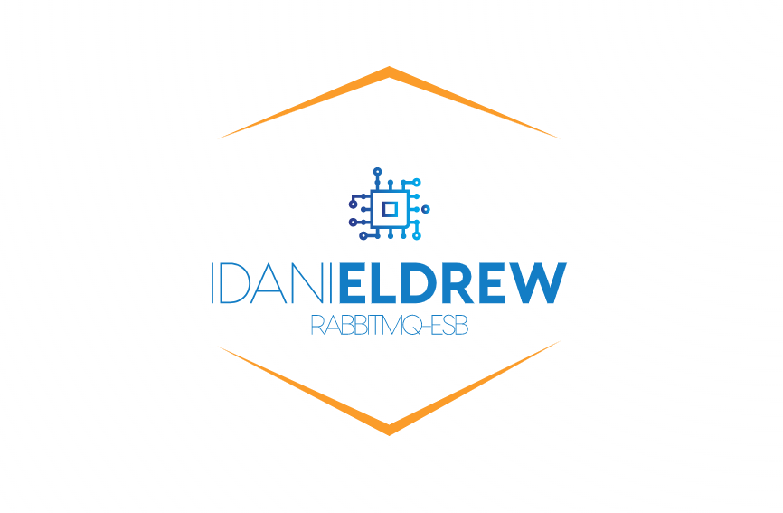

<p>
    
</p>
    <p>
        <a href="https://packagist.org/packages/pestphp/pest"></a>
        <a href="https://packagist.org/packages/idanieldrew/esb"></a>
        <a href="https://packagist.org/packages/pestphp/pest"></a>
    </p>

Esb support Pub/Sub in php and also support queue driver for Laravel.

* [Installation](#installation)
* [Usage](#usage)
    * [Quick start](*quick-start)

## Installation

Install with composer

```
composer require idanieldrew/esb
```

To publish the config

```
php artisan vendor:publish
```

and then select "esb-config" tag

## Usage

Publish messages with default exchange

```
use Idanieldrew\Esb\Facades\Esb;

// Publish message to queue
Esb::publish('queue','message'); 

```
